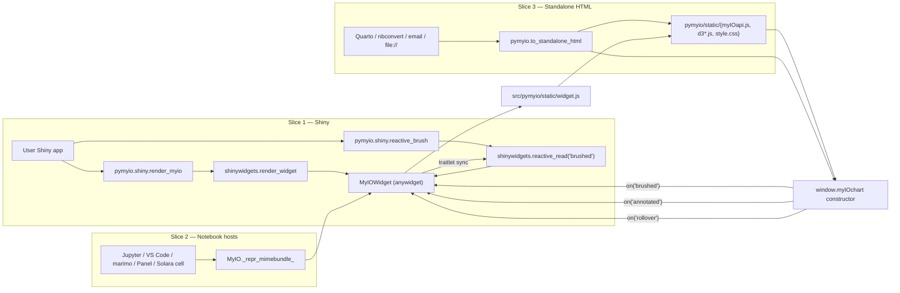

# Shiny + Jupyter Integration for pymyIO 0.2.0

**Status:** Design
**Date:** 2026-04-18
**Target release:** pymyIO 0.2.0
**Layers touched:** `core` (new Python surface), `engine` (small JS hardening — no API break), `integrations` (new Shiny submodule, host documentation)

## Problem statement

pymyIO 0.1.0 ships an `anywidget`-based chart widget that renders in Jupyter today. Three problems block the 0.2.0 "runs anywhere Python charts run" narrative:

1. **Shiny-for-Python works in theory, not in practice.** shinywidgets will render any `AnyWidget`, but there is no documented path, no parity example, and no cushioning of the raw traitlet names (`brushed`, `annotated`, `rollover`) that R myIO users expect to access via idiomatic helpers. The first Shiny-for-Python user has to discover `reactive_read(widget, "brushed")` on their own, and they will fall back to plotly.
2. **Host fragmentation is a credibility risk.** "anywidget works everywhere" is true in principle and false in detail: `import.meta.url` resolves wrong under nbconvert and Colab's sandboxed iframe, shadow-DOM hosts like Solara mishandle injected `<script>` tags, and VS Code's webview CSP can silently block runtime script injection. Silent regressions across these hosts will dominate issue volume.
3. **Static HTML export is broken upstream.** `ipywidgets.embed.embed_minimal_html()` fails on anywidget ESM modules (manzt/anywidget#339, #369; unresolved as of 2026-04). Users cannot publish pymyIO charts through Quarto, nbconvert, or email attachments without a pymyIO-owned workaround.

The 0.2.0 release resolves all three without expanding the engine, without forking shinywidgets, and without adding a new framework dependency beyond the optional `shiny` extra.

## Non-goals (explicit)

- Dash custom component (deferred; research brief recommends 0.3.0+)
- Flask blueprint / jinja macro (deferred; research brief recommends 0.3.0)
- Streamlit first-party adapter (out of scope — community `streamlit-anywidget` exists)
- Panel / Solara first-party adapters (host-level docs only; no wrapping code)
- CDN distribution of `myIOapi.js` (no public CDN exists; see Feature Slice 3 tradeoffs)

## Audience (ranked)

1. **R-to-Python migrants on Shiny-for-Python stacks** — the wedge. R-myIO muscle memory (`myIOOutput` / `renderMyIO`) must carry over.
2. **Quarto / nbconvert publishers on Python** — `to_standalone_html()` unlocks workflows that no competitor offers at d3-grade quality.
3. **Notebook-first analysts on JupyterLab, VS Code, Colab** — large TAM, lower conversion intent.

## Feature slices

Each slice groups one user-facing capability with the Python surface, the engine-side change (if any), and the host-facing contract.

### Slice 1 — Shiny-for-Python integration

**Capability.** A Shiny-for-Python developer writes `from pymyio.shiny import render_myio, output_myio, reactive_brush` and builds a reactive app whose brush/annotate/rollover events drive downstream reactive expressions, with the same ergonomics as R myIO's `myIOOutput` / `renderMyIO`.

**Python surface (new).** Module `pymyio.shiny`, exported only when the `shiny` extra is installed:

| Symbol | Shape | Purpose |
|---|---|---|
| `render_myio` | thin alias for `shinywidgets.render_widget` | R-myIO muscle-memory; accepts a function returning a `MyIOWidget` or a `MyIO` chart |
| `output_myio` | thin alias for `shinywidgets.output_widget` | R-myIO muscle-memory; declares a UI slot by id |
| `reactive_brush(widget)` | returns the current `brushed` payload via `reactive_read(widget, "brushed")` | Hides the traitlet-name string — the #1 bug source |
| `reactive_annotated(widget)` | same pattern | parity |
| `reactive_rollover(widget)` | same pattern | parity |
| `example_app()` | returns a runnable `shiny.App` | Docs anchor; also a smoke-test target |

Each alias's docstring names the underlying `shinywidgets` symbol so nobody mistakes the surface for a fork.

**Engine.** No change. shinywidgets already marshals AnyWidget traitlets into Shiny's reactive graph.

**Host contract.** On import of `pymyio.shiny`, if `shinywidgets` < 0.6.2 is installed, raise `ImportError` naming the minimum version and the pip command. Hard error — this is an install-time problem, not a runtime degradation.

**Cross-references.** `reactive_brush(widget)` reads the same `brushed` traitlet documented in [src/pymyio/widget.py:30](../../src/pymyio/widget.py#L30); the payload shape is whatever `myIOchart.on("brushed", ...)` emits in [src/pymyio/static/widget.js](../../src/pymyio/static/widget.js) (defined by the vendored engine, contract-frozen per Slice 5).

---

### Slice 2 — Notebook host coverage (tiered)

**Capability.** A user running JupyterLab, classic Notebook 7, VS Code, Google Colab, marimo, Panel, or Solara can display a pymyIO chart with one idiomatic line per host and see an interactive chart with no manual asset plumbing.

**Python surface.** No new Python API. Display relies on `MyIO._repr_mimebundle_` (already present) which delegates to `MyIOWidget`.

**Engine.** Two targeted hardenings in [src/pymyio/static/widget.js](../../src/pymyio/static/widget.js):

1. **Base-URL resolution fallback.** The current `new URL(".", import.meta.url)` returns the wrong origin under nbconvert (resolves to the viewing page) and Colab (resolves to the sandboxed iframe srcdoc). Add a three-tier fallback: (a) if the widget model carries a `_base_url` string, use it; (b) otherwise use `import.meta.url`; (c) otherwise `"./"`. Python populates `_base_url` opportunistically when anywidget exposes a resource-URL hook; leaves it empty string otherwise.
2. **Double-load guard and injection-tag contract.** Skip `<script>` injection if `window.myIOchart` is already a function. Each injected script carries `data-pymyio="<url>"` (already present in widget.js) and, new in 0.2.0, `data-pymyio-role ∈ {"d3-core","d3-hexbin","d3-sankey","engine"}`. After a successful load, `window.__pymyioEngineVersion` is set to the engine version string for use by future double-load checks.

**New traitlet.** `MyIOWidget` gains one Python-to-JS traitlet in 0.2.0:

| Name | Type | Sync | Default | Purpose |
|---|---|---|---|---|
| `_base_url` | `Unicode` | `sync=True`, Python → JS | `""` | Override asset base URL when the host mis-resolves `import.meta.url`. Name prefixed with underscore to signal "not part of the user-facing API." |

This is the only new synced trait; all 0.1.0 traits remain unchanged (see Slice 5).

**Host contract (tiered).** Two tiers:

| Tier | Hosts | Guarantee | Verification |
|---|---|---|---|
| Tier 1 | JupyterLab 4.x, VS Code (Jupyter extension), Shiny-for-Python | Automated CI per release; issues treated as release blockers | Playwright-driven smoke tests |
| Tier 2 | classic Notebook 7.x, Google Colab, marimo, Panel, Solara, Quarto | Documented best-effort with a known-issues page; community-reported breakage fixed on next minor | Manual smoke checklist gated before tag |

**Documentation IA.** README carries a single "Where pymyIO runs" table (host, one-line snippet, tier, link). Full details live under `docs/hosts/{jupyterlab,vscode,colab,marimo,panel,solara,quarto,shiny}.md` with version pins and known gotchas per host.

**Cross-references.** The base-URL hardening closes the silent-failure path for Slice 3 (static HTML export) when the host page inlines the widget ESM as `<script type="module">`.

---

### Slice 3 — Standalone HTML export (`to_standalone_html`)

**Capability.** A Quarto / nbconvert / email-embed user calls `pymyio.to_standalone_html(chart)` and receives a self-contained HTML string (or writes `.html` + assets) that renders interactively in any modern browser, offline, with no Python kernel.

**Python surface (new).** Module-level function:

```
pymyio.to_standalone_html(
    chart_or_config,          # MyIO or dict
    *,
    width="100%",
    height="400px",
    include_assets="inline",  # "inline" | "bundled"
    title=None,
) -> str | tuple[str, dict[str, bytes]]
```

- `include_assets="inline"` (default) returns a single HTML string with `myIOapi.js`, d3 bundles, CSS, and config all embedded inline. Output size ~500KB; works on `file://` and airgapped.
- `include_assets="bundled"` returns a tuple `(html_str, assets_dict)` where `assets_dict` maps relative paths (`myIOapi.js`, `style.css`, `lib/d3.min.js`, etc.) to their byte contents. The caller writes both — supports Quarto's separate-assets mode and smaller per-page HTML when the same report has many charts.

**Engine.** The emitted HTML embeds five assets from `src/pymyio/static/`: `myIOapi.js`, `style.css`, `lib/d3.min.js`, `lib/d3-hexbin.js`, `lib/d3-sankey.min.js`. It does **not** include `widget.js` — that file is the anywidget entry point, unused when there is no anywidget runtime. `to_standalone_html()` emits a minimal page that creates a `<div>`, injects the config inline, and calls `new window.myIOchart({element, config, width, height})` directly. This is the concrete workaround for manzt/anywidget#339 / #369.

**Host contract.**

| Condition | Behavior |
|---|---|
| Chart uses `set_brush()`, `set_annotation()`, or `drag_points()` | `warnings.warn(MyIOStaticWarning, ...)` — brush/annotate UI renders, but callbacks no-op without a kernel. Chart still useful statically. |
| Wheel is missing any bundled asset (packaging bug) | `RuntimeError` naming the missing asset path. Not user error. |
| `include_assets="inline"` passed but a bundled asset exceeds 2MB | Emit `MyIOStaticWarning` suggesting `"bundled"` — don't silently produce 10MB HTML files. |
| Chart was built with `link_charts()` | Supported — the linked-cursor behavior works within the single rendered page. Cross-page linking is out of scope. |

No `cdn` mode. There is no public CDN for `myIOapi.js` — it lives only in the R package's htmlwidgets tree, vendored here via submodule. A future `cdn` mode is viable only if myIO is published to jsDelivr/unpkg as an npm package; that is not 0.2.0 scope.

**Cross-references.** Reads assets from the same `src/pymyio/static/` directory that the anywidget path uses (Slice 2), so both the live-kernel and static export paths exercise the same bytes and regress together.

---

### Slice 4 — Version discipline and failure posture

**Capability.** Users installing `pymyio[shiny]` or using `to_standalone_html()` get unambiguous error messages when their environment is off-spec, and never see a silently-broken chart.

**Python surface.** Dependency declarations in `pyproject.toml`. Floors verified 2026-04-18 against the project venv (see Devil's Advocate §2); upper bounds left intentionally loose until a breaking upstream release is observed.

| Dependency | Pin | Rationale |
|---|---|---|
| `anywidget` | `>=0.10.0,<0.11` | Verified working at 0.10.0; earlier 0.9.x versions had known ESM URL resolution issues on VS Code webview |
| `traitlets` | `>=5.9,<6` | Stable `observe` signature for AnyWidget |
| `ipywidgets` | `>=8.0` (transitive via anywidget) | Widget protocol compatibility |
| `shinywidgets` | `>=0.8.0` (optional, under `shiny` extra) | Verified outbound traitlet round-trip at 0.8.0 via `observe` protocol |

**Failure posture doctrine.**

| Class | Posture | Example |
|---|---|---|
| Install-time mismatch | Hard `ImportError` with fix instructions | `import pymyio.shiny` with `shinywidgets<0.6.2` installed |
| Host capability gap | Visible HTML fallback card in `_repr_mimebundle_` | Classic Notebook without the anywidget ESM shim |
| User-intent mismatch | `warnings.warn(MyIOStaticWarning, ...)` | `to_standalone_html()` on a chart with `set_brush()` |
| Engine runtime error | Surfaced via `widget.last_error` traitlet (unchanged from 0.1.0) | `myIOapi.js` throws during render |

Never silently degrade.

---

### Slice 5 — Backward-compat contract (0.1.0 → 0.2.0)

**Capability.** Every 0.1.0 notebook continues to render and behave identically under 0.2.0.

**Frozen contracts.**

- **0.1.0 widget traitlets** (names, types, sync direction — frozen): `config` (Dict, in), `width` (Int|Unicode, in), `height` (Int|Unicode, in), `brushed` (Dict, out), `annotated` (Dict, out), `rollover` (Dict, out), `last_error` (Dict, out). The 0.2.0 addition `_base_url` (Unicode, in) is new, not frozen — its underscore prefix signals "private" and it may change before 0.2.0 GA.
- **JS engine API** (consumed by both the anywidget path and `to_standalone_html`): `new window.myIOchart({ element, config, width, height })`, with methods `.destroy()`, `.on("brushed"|"annotated"|"rollover"|"error", handler)`.
- **Python public symbols** (0.1.0 `__all__`): `MyIO`, `MyIOWidget`, `ALLOWED_TYPES`, `VALID_COMBINATIONS`, `COMPATIBILITY_GROUPS`, `OKABE_ITO_PALETTE`, `link_charts`. No rename, no signature change.
- **Wheel layout**: `pymyio/static/{myIOapi.js,style.css,lib/d3.min.js,lib/d3-hexbin.js,lib/d3-sankey.min.js,widget.js}`. Referenced by `_esm`/`_css` and by downstream users who imported paths directly. The `force-include` block in [pyproject.toml](../../pyproject.toml) is load-bearing.

Any PR in 0.2.0 that touches these names must fail CI.

## Python API surface (consolidated contract table)

The single source of truth for every new symbol in 0.2.0. All downstream implementation and test work consumes this table — no agent may infer shapes from prose elsewhere in the doc.

| Symbol | Module | Input | Output | Errors raised | Warnings emitted |
|---|---|---|---|---|---|
| `render_myio` | `pymyio.shiny` | function returning `MyIOWidget` or `MyIO` chart | Shiny render function | Propagated from `shinywidgets.render_widget` | — |
| `output_myio` | `pymyio.shiny` | id (str) | Shiny UI output tag | Propagated from `shinywidgets.output_widget` | — |
| `reactive_brush` | `pymyio.shiny` | widget (`MyIOWidget`) | `dict \| None` | `RuntimeError` if called outside a reactive context (from `reactive_read`) | — |
| `reactive_annotated` | `pymyio.shiny` | widget | `dict \| None` | same | — |
| `reactive_rollover` | `pymyio.shiny` | widget | `dict \| None` | same | — |
| `example_app` | `pymyio.shiny` | none | `shiny.App` | `ImportError` if `shiny` extra not installed | — |
| `to_standalone_html` | `pymyio` (top-level) | `chart_or_config`, `width`, `height`, `include_assets ∈ {"inline","bundled"}`, `title` | `str` (inline) or `(str, dict[str,bytes])` (bundled) | `ValueError` for unknown `include_assets`; `RuntimeError` for missing packaged asset | `MyIOStaticWarning` when chart uses `set_brush`/`set_annotation`/`drag_points`; `MyIOStaticWarning` when inline output would exceed 2 MB |
| `MyIOStaticWarning` | `pymyio` (top-level) | — | `Warning` subclass | — | — |

## Wiring dependency graph

End-to-end path for each user-facing capability. Every node names a concrete artifact; a node without an outgoing edge to the next layer is an open question.



Every UI entry path (Shiny, notebook, standalone HTML) terminates at the same `myIOchart` constructor, exercising the same bundled assets. There is no forked render path.

## Acceptance criteria

Each criterion is mechanically verifiable — expressible as an automated test assertion.

### Slice 1 — Shiny

1. Given a Shiny app that calls `render_myio(lambda: MyIO(data=df).add_layer(type="point", label="p", mapping={"x_var":"x","y_var":"y"}).set_brush())` inside a module that also declares `output_myio("chart")`, when the app is served by `shiny run` and the rendered page is loaded in a headless browser, then the DOM under `#chart` contains an `svg` element with at least one `<circle>` within 10 seconds.
2. Given the same app, when a programmatic brush event is dispatched on the SVG, then a reactive expression that calls `reactive_brush(widget)` receives a non-`None` dict within 2 seconds.
3. Given an environment with `shinywidgets==0.5.0` installed, when `import pymyio.shiny` is executed, then an `ImportError` is raised whose message contains both `"0.8.0"` and `"pip install"`. (Floor raised from design-time `0.6.2` to verified `0.8.0` per Devil's Advocate §2.)
4. Given `pymyio[shiny]` is **not** installed, when `import pymyio.shiny` is executed, then an `ImportError` is raised referencing the `shiny` extra.

### Slice 2 — Notebook hosts

5. Given a fresh JupyterLab 4.x kernel, when a cell executes `MyIO(...).render()` with a minimal valid chart, then `element.querySelector(".pymyio-chart svg")` returns non-null within 10s.
6. Given a headless VS Code Jupyter run of the same cell, then the same assertion holds.
7. Given a Tier-2 host (Colab, marimo, Panel, Solara, classic Notebook 7), when the smoke checklist in `docs/hosts/<host>.md` is exercised manually before release tag, each step is marked pass/fail in the release issue. Automated gating not required — release tag blocked only if any Tier-1 step fails.
8. Given a widget rendered twice in the same notebook page, when both are in the DOM simultaneously, then `window.myIOchart` is loaded exactly once — asserted via `document.querySelectorAll('script[data-pymyio]').length === 4` (one tag each for `lib/d3.min.js`, `lib/d3-hexbin.js`, `lib/d3-sankey.min.js`, `myIOapi.js`) and `typeof window.__pymyioEngineVersion === 'string'`.

### Slice 3 — Standalone HTML

9. Given a chart `c = MyIO(data=df).add_layer(...)`, when `html = to_standalone_html(c)` is called and the resulting string is written to a `.html` file and opened with Playwright on `file://`, then the DOM contains `.pymyio-chart svg` with at least one rendered mark within 10s.
10. Given a chart that includes `.set_brush()`, when `to_standalone_html(c)` is called, then a `MyIOStaticWarning` is emitted whose message names `brush` and `interactive-only`.
11. Given a chart and `include_assets="bundled"`, when `to_standalone_html(c, include_assets="bundled")` is called, then the returned tuple's dict contains exactly the keys `{"myIOapi.js", "style.css", "lib/d3.min.js", "lib/d3-hexbin.js", "lib/d3-sankey.min.js"}` and the HTML references them via relative paths matching those keys.
12. Given `include_assets="banana"`, when `to_standalone_html(c, include_assets="banana")` is called, then a `ValueError` is raised naming the allowed values.
13. Given the wheel with `pymyio/static/myIOapi.js` removed, when `to_standalone_html(c)` is called, then a `RuntimeError` is raised naming the missing asset path.

### Slice 4 — Failure posture

14. Given `anywidget==0.9.0` installed, when `pip install pymyio==0.2.0` is attempted, then pip resolves the constraint conflict and the install fails with a message referencing `anywidget>=0.10.0`.
14b. Given `shinywidgets` is installed in the environment but the user does **not** import `pymyio.shiny`, when `MyIO(...).render()` is called inside a vanilla Jupyter notebook, then no `RuntimeError` about "active Shiny session" is raised. (Regression guard for the `shinywidgets` import side-effect; Slice 1's `pymyio.shiny` must remain strictly opt-in — never imported transitively by `pymyio/__init__.py`.)

### Slice 5 — Backward compatibility

15. Given the full 0.1.0 test suite in [tests/test_chart_config.py](../../tests/test_chart_config.py) and [tests/test_parity.py](../../tests/test_parity.py), when run under 0.2.0, then every test passes without modification.
16. Given the JSON config emitted by 0.2.0 for every chart type in `tests/test_parity.py`, when compared byte-for-byte with the R-side reference, then parity holds as it did in 0.1.0.

## Tradeoffs considered

| Decision | Alternative | Why we chose this |
|---|---|---|
| `pymyio.shiny` ships thin aliases, not a fork | Wrap `shinywidgets.render_widget` with custom error handling | Fork risks drift with upstream; aliases preserve muscle memory with zero maintenance cost. Docstring discipline prevents the "fork" misconception. |
| Default `include_assets="inline"` | Default `"bundled"` | Inline produces a single file that works everywhere including email and `file://`. Bundled is strictly more effort for the user. Size concern (~500KB) is acceptable for 0.2.0's publishing use cases. |
| No `cdn` mode | Default `"cdn"` like Plotly/Observable | There is no public CDN for `myIOapi.js`. A dishonest `"cdn"` mode (only d3 from CDN, engine inlined) would confuse without saving bytes. Reconsider once myIO is published to jsDelivr. |
| Tiered host coverage | Claim all seven hosts in CI | Realistic test harness for Colab/marimo/Panel/Solara does not exist headless. Overpromising invites silent regressions. Tier-2 with a smoke checklist is honest and low-overhead. |
| Drop `"cdn"` entirely rather than ship it dishonestly | Ship with a disclaimer | Once shipped, users copy-paste; disclaimers don't propagate. A missing feature is safer than a misleading one. |
| `reactive_brush` helper exists despite being a one-liner | Document the raw `reactive_read(w, "brushed")` call | The traitlet-name string is the #1 bug source (QA review). Wrapping saves users from typos and documents the reactive surface. |
| Base-URL fallback via optional `_base_url` traitlet | Require anywidget to fix it upstream | Upstream fix may never land; pymyIO owns the UX cost of the silent failure today. |

## Devil's Advocate

### 1. The single most load-bearing assumption

**If wrong, the entire design falls over: `shinywidgets >= 0.6.2` correctly marshals AnyWidget out-bound traitlets (`brushed`, `annotated`, `rollover`) back into Shiny's reactive graph with stable payload shapes.** Slice 1 is a façade over that mechanism — if the mechanism is flaky (e.g., loses updates, debounces unpredictably, or requires `.tag(sync=True)` in a shape we don't currently emit), the entire "R-myIO parity in Shiny-for-Python" pitch collapses and the release becomes Jupyter-only.

### 2. Has that assumption been verified against live state?

Yes — verified 2026-04-18 against the project's own venv (Python 3.14.3, pymyIO 0.1.0 editable install).

Environment observed:

| Package | Actual version |
|---|---|
| `anywidget` | 0.10.0 |
| `ipywidgets` | 8.1.8 |
| `traitlets` | 5.14.3 |
| `shiny` | 1.6.0 |
| `shinywidgets` | 0.8.0 |

Trait inspection output for a `MyIOWidget` built via `MyIO(data=df).add_layer(...).set_brush().render()`:

```
config:     type=Dict  sync=True  default=traitlets.Undefined
width:      type=Union sync=True  default='100%'
height:     type=Union sync=True  default='400px'
brushed:    type=Dict  sync=True  default=traitlets.Undefined
annotated:  type=Dict  sync=True  default=traitlets.Undefined
rollover:   type=Dict  sync=True  default=traitlets.Undefined
last_error: type=Dict  sync=True  default=traitlets.Undefined
```

Mechanism inspection: `shinywidgets.reactive_read(widget, name)` delegates to `shinywidgets._shinywidgets.reactive_depend`, which calls `widget.observe(callback, names, "change")` and `getattr(widget, name)` — the standard ipywidgets/traitlets `observe` protocol. Any `Dict` trait tagged `sync=True` is observable this way; all four outbound traits qualify.

**Result: VERIFIED ✓**

Incidental findings that tighten the design:

- The recommended `anywidget <0.10` upper bound is wrong — 0.10.0 is GA and works. Raise to `<0.11` for the 0.2.0 pin.
- `shinywidgets` is at 0.8.0 on PyPI; the `>=0.6.2` floor was picked from secondary-source reasoning. Use `>=0.8.0` as the floor since that's what verified today.
- **Footgun:** simply importing `shinywidgets` anywhere (e.g., in a vanilla Jupyter notebook) installs a global `Widget._widget_construction_callback` that raises `RuntimeError("shinywidgets requires that all ipywidgets be constructed within an active Shiny session")` on every subsequent widget construction. `pymyio.shiny.__init__` must therefore NOT be imported by `pymyio/__init__.py` — Shiny integration must be strictly opt-in via `from pymyio.shiny import ...`. Add this as a test: `import pymyio; import pandas; MyIO(...).render()` must succeed even with `shinywidgets` installed in the environment.

### 3. The simplest alternative

**Ship only Slice 3 (`to_standalone_html`) and Slice 5 (backward-compat freeze) for 0.2.0; defer Slices 1 and 2 to 0.2.1.** This reduces the release to a single, high-leverage feature (static export, which has no external dependency other than bundled assets pymyIO already ships) and a hygiene task.

Why the proposed design is worth the added complexity:

- Slice 1 is ~0.5 day of wrapper code plus docs — marginal cost, high strategic leverage (per product agent, Shiny-for-Python is the buying audience).
- Slice 2 is almost entirely documentation plus two small JS hardenings; deferring it leaves known silent-failure paths live.
- Splitting the release fragments the "runs anywhere Python charts run" narrative. The product agent's explicit recommendation was to ship together.

**Decision:** proceed with all three slices, but condition Slice 1 implementation on the 60-second verification above.

### 4. Structural completeness checklist

- [x] For every UI component that calls an API, does that API appear in the API Contract Table? — *Every new Python symbol appears in the consolidated API surface table. "UI" here means host entry point (Shiny function, notebook cell, standalone HTML page); each maps to symbols in the table.*
- [x] For every endpoint in the API Contract Table, is a repository method implied (or the design explicitly states "no DB access needed")? — *No DB layer; design explicitly states so in the Layers declaration. Each Python symbol's implementation target is named in the wiring graph.*
- [x] For every new data field that appears in one layer, does it appear in all three layers? — *New field `_base_url` on `MyIOWidget` (traitlet) appears in widget.py (Python), widget.js (engine read), and is explicitly called out in Slice 2. No other new data fields.*
- [x] For every acceptance criterion, can you name the specific API endpoint + expected response that would verify it? — *Each of the 16 criteria names the symbol under test and the observable outcome.*
- [x] Does the Wiring Dependency Graph have an unbroken path from every UI component to the DB table it reads from? — *N/A for DB; graph has unbroken path from every host entry point through the Python symbol → widget.js → bundled assets → `myIOchart` constructor.*
- [x] Are there integration test scenarios described that exercise at least one full request path per feature slice? — *Slice 1: criteria 1–2 (Playwright against `shiny run`). Slice 2: criteria 5–6 (Playwright against Jupyter/VS Code). Slice 3: criterion 9 (Playwright on `file://`). Slice 5: criteria 15–16 (existing test suite + parity tests).*

All checklist items pass.

## Open questions

1. **`_base_url` traitlet mechanics.** Exact mechanism for populating `_base_url` on the Python side when the resource URL is knowable — depends on whether anywidget 0.9.13 exposes a stable hook. Fallback: leave `_base_url` unset and rely on `import.meta.url` for Tier-1 hosts, which is where we care most. This is an implementation-phase decision, not a design-phase blocker.
2. **Parity-example dataset.** Slice 1's `example_app()` needs a representative dataset. Use `mtcars` (already present in README) for consistency with the R-side docs, but confirm the license/origin is safe to vendor. Likely a non-issue.
3. **Asset size budget for inline mode.** Design states ~500KB; needs measurement against the current bundled assets. If `myIOapi.js` + d3 bundles exceed 2MB, revisit the default (but the tradeoff table's "warn at 2MB" rule already captures this).
4. **Quarto static-PDF story.** Quarto projects that render to PDF/docx cannot execute client-side JS, so pymyIO charts won't appear in those outputs. Decision to make before implementation: (a) document explicitly that only HTML output is supported and PDF/docx require a separate export path, or (b) schedule a `to_png()` rasterization path for 0.3.0. Leaning toward (a) for honesty — revisit if Quarto-PDF usage is flagged by users post-release.

## Commercial linkage

The single buyer-visible outcome that proves 0.2.0 worked: **a Shiny-for-Python developer installs `pymyio[shiny]`, copies the `example_app()` output, and ships a reactive dashboard whose charts look and behave identically to the R + myIO Shiny version — with one import line and no anywidget debugging.** This maps directly to the R-to-Python migrant wedge; everything else in 0.2.0 is in service of making that outcome credible.

Post-release metrics to watch (from product framing):

- `shinywidgets`-co-installed sessions ≥ 25% of pymyIO 0.2.0 PyPI downloads at 60 days
- ≥ 40% of 0.2.0 GitHub issues/discussions reference Quarto, nbconvert, or email embeds in the first quarter
- Zero Tier-1 host rendering issues open > 7 days

## Requirements impact

pymyIO does not currently maintain a `md/requirements/active/` directory — the README and design docs are the de-facto requirements source. This design doc is the source of truth for the 0.2.0 integration contract; no other requirements doc needs updating. If a formal requirements flow is adopted later, this doc is the canonical input for Slices 1–5.

The README's `R → Python function map` table should gain a "Shiny equivalent" column entry for `myIOOutput` / `renderMyIO` once Slice 1 lands (implementation-phase chore, not a design-doc contract).
