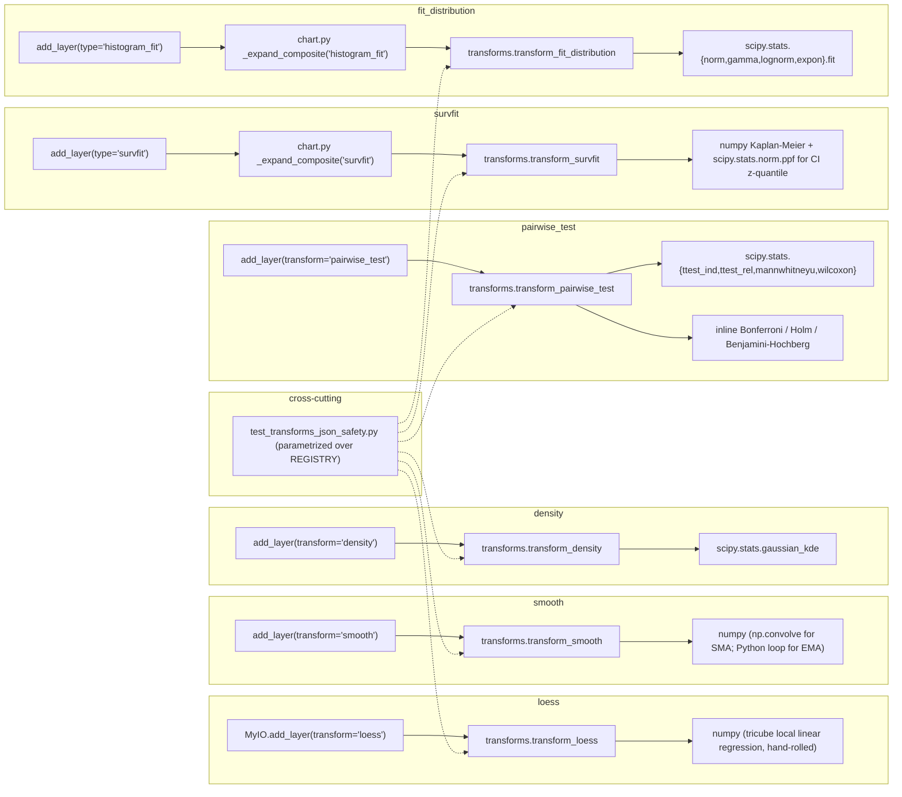

# Statistical Transforms for pymyIO

**Status:** Design
**Date:** 2026-04-18
**Layers touched:** `core` (transforms.py), `packaging` (pyproject.toml), `tests`

## Problem statement

Six entries in `pymyio.transforms.REGISTRY` currently raise `NotImplementedError` on call: `loess`, `smooth`, `density`, `pairwise_test`, `survfit`, `fit_distribution`. Real users calling `.add_layer(transform="loess")` or `.add_layer(type="survfit")` today get an exception instead of a chart. The missing transforms block two Python-advertised composite chart types (`survfit`, `histogram_fit`) and five layer-level transform options advertised in `VALID_COMBINATIONS`.

This design implements all six as Python-native statistical routines. **R parity is explicitly NOT a goal.** Each transform does a reasonable statistical thing and returns JSON-serializable records the JS engine can render. Numeric behavior tracks the Python library being used (scipy, numpy), not R's.

## Non-goals (explicit)

- **No R parity.** Not byte-exact, not behaviorally equivalent, not "close to R." These transforms implement the documented per-transform contract below and stop there. Migrants porting an R dashboard should expect the chart shapes to look similar but the exact numeric values will differ.
- **No R reference fixtures.** Tests exercise behavioral properties of each algorithm (SMA of a constant is that constant; KDE of normal data peaks near zero; Kaplan-Meier of all-censored data stays at survival=1.0). No R install, no fixture pipeline, no drift-guard around R versions.
- **No optional `stats` extra.** The required install either renders all advertised transforms or it doesn't. No lazy-import gymnastics.
- **No pandas or lifelines or statsmodels dependency.** Kept out to hold the install surface to numpy + scipy.

## Audience

1. R-to-Python migrants porting myIO charts — they hit these transforms immediately and expect them to produce *something reasonable*, not necessarily R-identical.
2. Python-native analytics teams adopting myIO for d3 output — they want `survfit` and `fit_distribution` specifically (the Python-forward chart types).
3. New evaluators — removing the "six advertised transforms `NotImplementedError`" footgun prevents immediate bounce.

## Dependency decision

**Two required deps, added to `[project].dependencies`:**

- `numpy >= 1.24`
- `scipy >= 1.11`

Combined wheel-weight increase: ≈ 45 MB.

Explicitly **NOT** added:
- `statsmodels` — avoided by hand-rolling LOWESS (~30 lines of local weighted regression) and multiple-testing correction (~20 lines of Bonferroni / Holm / Benjamini-Hochberg).
- `lifelines` — avoided by hand-rolling Kaplan-Meier (~20 lines of numpy).
- `pandas` — avoided by writing SMA/EMA in pure numpy.

**Rejected alternative:** optional `stats` extra. Declined because six advertised transforms silently `NotImplementedError`ing on a default `pip install pymyio` is worse than a 45 MB install.

## Feature slices

Each slice is one transform. All six read `(records, mapping, options)` and return `(records, meta)` per the existing transform protocol in `pymyio.transforms`.

**Cross-slice conventions** referenced throughout:

- **`mapping`** is a dict `{role: column_name}` where roles are `x_var`, `y_var`, `time`, `status`, `value`, etc. A column reference like `mapping["x_var"]` names the input column on the records list; a literal string like `"x_var"` used as an output key is NOT interpolated (the JS engine and composite expansions read the literal key).
- **Output-key style.** Slices 1, 2 (LOESS, smooth) emit output records keyed by the mapping's column name (e.g., `{mapping["x_var"]: ..., mapping["y_var"]: ...}`). Slices 3, 6 (density, fit_distribution) emit records keyed by the LITERAL strings `"x_var"`, `"y_var"`, `"low_y"`, `"high_y"` — these keys are what the composite expansion code and JS engine read, so they are fixed identifiers, not interpolated names.
- **Record `_source_key`.** Input records carry `_source_key` as row-level provenance. When a transform emits *grid* rows (LOESS, density, fit_distribution) it assigns synthetic keys like `"grid_{i}"` (1-indexed). When a transform preserves input rows (smooth, survfit) it forwards the input's `_source_key` unchanged.
- **Meta `sourceKeys` convention.** Fixed sentinel:
  - `null` — aggregate transforms where no single input row maps to a single output (density, pairwise_test, fit_distribution).
  - `[<list of contributing input _source_key values>]` — row-derived transforms where the output rows trace back to specific input rows (LOESS records input keys that passed NaN-filtering; smooth records the output row keys; survfit records input keys of rows that contributed to the KM table).
  - `[]` — empty list only when the input was empty or fully filtered out; never used as "not applicable."
- **JSON safety.** Every numeric value in records and meta is hard-cast to Python `float` or `int` before return. No `numpy.generic` subclass may leak. Enforced by criterion 20.

### Slice 1 — `loess`

- **Algorithm.** Local linear regression with tricube kernel weights (simplified Cleveland). Hand-rolled, ~30 lines. For each of `n_grid` evenly-spaced query points between `min(x)` and `max(x)`: compute tricube weights as a function of distance from the query point scaled by the local bandwidth; fit a weighted linear regression on the weighted subset; emit the fitted y.
- **Input mapping.** `x_var`, `y_var`.
- **Options.** `span` (default 0.75, fraction of points in the local window), `n_grid` (default 100). `degree` is accepted for forward-compat but ignored — degree-1 only.
- **Return contract.** `n_grid` dicts sorted ascending by the `mapping["x_var"]` column. Each record keyed by the mapping's column names plus a synthetic grid key: `{mapping["x_var"]: float, mapping["y_var"]: float, "_source_key": "grid_{i}"}` (i 1-indexed; note the grid keys live in a DIFFERENT namespace from input `_source_key` values). Meta: `{"name": "loess", "sourceKeys": [<non-NaN input _source_key values>], "derivedFrom": "input_rows"}`. The meta's `sourceKeys` is input-row provenance (tracks which input rows survived NaN filtering and contributed to the fit) — it is NOT the list of emitted grid keys.
- **Degenerate cases.** Fewer than 4 complete (x, y) pairs → `warnings.warn` + empty records + meta with `"sourceKeys": []`. Zero-variance x after filtering → warn + empty.

### Slice 2 — `smooth`

- **Algorithm.** Pure numpy. SMA: centered moving average via `np.convolve(y_sorted, np.ones(window)/window, mode='valid')` with edge rows dropped (equivalent to `stats::filter(..., sides=2)` centered). EMA: explicit recursion `ema[i] = alpha * y[i] + (1 - alpha) * ema[i-1]`, seeded with `ema[0] = y_sorted[0]`.
- **Input mapping.** `x_var`, `y_var`.
- **Options.** `method` (`"sma"` default, or `"ema"`), `window` (SMA default 7), `alpha` (EMA default 0.3). Unknown method raises `ValueError`.
- **Return contract.** Records sorted ascending by the `mapping["x_var"]` column: `{mapping["x_var"]: float, mapping["y_var"]: float, "_source_key": str}` with `_source_key` forwarded unchanged from the corresponding input row. SMA drops the `window // 2` rows at each edge; EMA preserves all rows. Meta: `{"name": "smooth", "sourceKeys": [<output row _source_key values in order>], "derivedFrom": "input_rows"}`.
- **Degenerate cases.** `window > len(records)` → `warnings.warn` and clamp `window = len(records)`. Empty input → empty records + meta with empty `sourceKeys`.

### Slice 3 — `density`

- **Algorithm.** `scipy.stats.gaussian_kde` with Scott's rule bandwidth (scipy default). Evaluate on a 128-point grid spanning `min(y) - 3*bw` to `max(y) + 3*bw`. Numeric bandwidth override accepted via the `bandwidth` option; string bandwidths are not supported (R's `"nrd0"` is deliberately not ported).
- **Input mapping.** `y_var`.
- **Options.** `bandwidth` (default `None`, uses Scott's rule; numeric values forwarded to scipy), `mirror` (default `False`), `n_grid` (default 128).
- **Return contract.** 128 dicts sorted ascending by the literal output key `"x_var"`: `{"x_var": float, "low_y": float, "high_y": float}`. **These three keys are literal strings, NOT interpolated from the `mapping` dict** — the composite expansion in `chart.py` and the JS engine read these exact identifiers. `high_y` is the density estimate; `low_y = -high_y` when `mirror=True`, else `0.0`. No `_source_key` on the output rows (density is aggregate). Meta: `{"name": "density", "sourceKeys": null, "derivedFrom": "input_rows"}`.
- **Degenerate cases.** Empty input → `warnings.warn` + empty records. Zero-variance input (`np.std(y) == 0`) → warn + empty (pre-checked before calling scipy). `scipy.linalg.LinAlgError` from `gaussian_kde` on unexpected singular matrices → warn + empty.

### Slice 4 — `pairwise_test`

- **Algorithm.** `scipy.stats.ttest_ind(equal_var=False)` (Welch t-test), `scipy.stats.ttest_rel` (paired t), `scipy.stats.mannwhitneyu(alternative='two-sided')` (unpaired Wilcoxon), `scipy.stats.wilcoxon` (paired Wilcoxon). Multiple-testing correction inline:
  - `"none"` — no change
  - `"bonferroni"` — `p * n_comparisons`, capped at 1.0
  - `"holm"` — Holm-Bonferroni step-down
  - `"bh"` — Benjamini-Hochberg step-up
  - Method-name aliases accepted: `"BH"` → `"bh"`.
- **Input mapping.** `x_var` (group labels, coerced to string), `y_var` (numeric).
- **Options.** `method` (`"t.test"` default; also `"wilcox.test"`), `p_adjust` (`"none"` default), `paired` (default `False`), `conf_level` (default 0.95, currently unused — accepted for forward-compat), `comparisons` (optional explicit list of `(group1, group2)` pairs; default is `itertools.combinations(groups, 2)` in input-order), `step_fraction` (default 0.08, controls bracket vertical spacing).
- **Return contract.** List of bracket dicts, one per comparison in the order produced by the comparisons iterable. All keys are literal strings (not interpolated from `mapping`): `{"x1": int, "x2": int, "y": float, "group1": str, "group2": str, "p_value": float | None, "label": str, "method": str, "statistic": float | None}`. `x1`/`x2` are 1-indexed integer positions in input-order. `y` stacks upward from `max(mapping["y_var"]) + step_fraction * y_range`, narrowest spans placed lowest. `label`: `"p < 0.001 ***"`, `"p = 0.XXX **"`, `"p = 0.XXX *"`, `"p = 0.XX ns"`, or `"p = NA"`. Meta: `{"name": "pairwise_test", "sourceKeys": null, "derivedFrom": "input_rows"}` — `null` per the aggregate-transform convention (no 1-to-1 row provenance).
- **Degenerate cases.** Non-numeric y → `TypeError`. Fewer than 2 groups → `ValueError`. A group of size < 2 → row emitted with `p_value=None`, `statistic=None`, `label="p = NA"`. Scipy's `ttest_ind` returns `(nan, nan)` silently in this case — the implementation must detect `math.isnan(p)` post-call and substitute `None`. More than 15 comparisons → `warnings.warn`.

### Slice 5 — `survfit`

- **Algorithm.** Numpy Kaplan-Meier plus a single `scipy.stats.norm.ppf` call for the CI z-quantile (scipy is already a required dep; no new surface). Sort unique event + censor times; for each event time compute `S(t) = S(t-) * (1 - d_i / n_i)` where `n_i` is count at-risk and `d_i` is event count. Log-log confidence bands via Greenwood variance when `conf_int` is provided. Implementation reference: Klein & Moeschberger §4.2.
- **Input mapping.** `time` (numeric, NaN allowed — dropped with warn; negative times dropped with warn), `status` (coerced — accepts Python `bool`, numpy bool, or integer in `{0, 1}`; any other value after coercion → `ValueError` listing the allowed forms).
- **Options.** `conf_int` (default `0.95`; `None` disables CI columns; otherwise must be in `(0, 1)`).
- **Return contract.** List of step-function rows sorted ascending by the literal key `"time"`. All keys are literal strings. Row shape: `{"time": float, "survival": float, "low_y": float, "high_y": float, "n_at_risk": int, "n_event": int}`. First row is a t=0 anchor: `{"time": 0.0, "survival": 1.0, "n_at_risk": <initial n>, "n_event": 0}`, plus `"low_y": 1.0, "high_y": 1.0` when CI is on (zero variance at t=0). When `conf_int is None`, `low_y` and `high_y` keys are OMITTED entirely (not set to null) on every row. Meta: `{"name": "survfit", "sourceKeys": [<_source_key values of rows that survived data-quality filters>], "derivedFrom": "input_rows", "conf_int": <level or None>}`.
- **Degenerate cases.** Empty input → `warnings.warn` + empty records + `sourceKeys: []`. All-censored input → survival stays at `1.0` for every row, no error (legitimate KM behavior). NaN time, NaN status, negative time → drop the row + `warnings.warn` (data-quality issue, not a structural error). Status value that is not coercible to bool or integer `{0, 1}` → `ValueError` (structural: caller passed something the transform cannot interpret).

### Slice 6 — `fit_distribution`

- **Algorithm.** `scipy.stats` named distributions — `norm`, `gamma`, `lognorm`, `expon`. MLE via `.fit()` with `floc=0` for positive-support distributions (`gamma`, `lognorm`, `expon`) to drop the nuisance location parameter. PDF evaluated on `numpy.linspace(min(value), max(value), n_grid)`.
- **Input mapping.** `value`.
- **Options.** `distribution` (default `"normal"`; one of `normal`, `gamma`, `lognormal`, `exponential`), `n_grid` (default 128). Unknown name → `ValueError` listing valid options.
- **Return contract.** `n_grid` dicts sorted ascending by the literal output key `"x_var"`: `{"x_var": float, "y_var": float}`. **These two keys are literal strings, NOT interpolated from the `mapping` dict** — the `histogram_fit` composite expansion in `chart.py` and the JS engine read these exact identifiers. Meta: `{"name": "fit_distribution", "distribution": str, "params": [float, ...], "sourceKeys": null, "derivedFrom": "input_rows"}` — `null` per the aggregate-transform convention.
- **Degenerate cases.** Empty input → `ValueError("no data")`. `lognormal` / `gamma` with any `value <= 0` → `ValueError` naming the positivity constraint (detected by catching scipy's `FitDataError` and re-raising). `exponential` with any negative value → `ValueError`. Zero-variance input for `normal` → scipy's `.fit` returns `(0, 0)` silently; detect `scale == 0` post-fit and raise `ValueError` with the distribution name.

## Python API surface (consolidated contract table)

| Transform | Required mapping keys | Option bag (defaults) | Returns | Raises |
|---|---|---|---|---|
| `loess` | `x_var`, `y_var` | `span=0.75`, `degree` (ignored), `n_grid=100` | `(records, meta)` per Slice 1 | none structural; warns on degenerate |
| `smooth` | `x_var`, `y_var` | `method="sma"`, `window=7`, `alpha=0.3` | `(records, meta)` per Slice 2 | `ValueError` on unknown method |
| `density` | `y_var` | `bandwidth=None`, `mirror=False`, `n_grid=128` | `(records, meta)` per Slice 3 | none structural; warns on degenerate |
| `pairwise_test` | `x_var`, `y_var` | `method="t.test"`, `p_adjust="none"`, `paired=False`, `conf_level=0.95`, `comparisons=None`, `step_fraction=0.08` | `(records, meta)` per Slice 4 | `ValueError` on <2 groups, `TypeError` on non-numeric y |
| `survfit` | `time`, `status` | `conf_int=0.95` | `(records, meta)` per Slice 5 | `ValueError` when a status value is not coercible to bool or `{0, 1}`; NaN/negative time drops the row with a warn (not an error) |
| `fit_distribution` | `value` | `distribution="normal"`, `n_grid=128` | `(records, meta)` per Slice 6 | `ValueError` on unknown distribution, empty, domain violation |

All six transforms emit JSON-serializable records — every numeric value hard-cast via `float()` / `int()`. No `numpy.float64` / `numpy.int64` may leak.

## Wiring dependency graph



Every transform terminates at a real numpy or scipy call. No deps outside the (numpy, scipy) pair.

## Acceptance criteria

Each criterion is mechanically verifiable.

### Slice 1 — loess
1. Given 100 points sampled from `y = 2*x + 1 + noise(σ=0.1)` with `x ∈ [0, 10]` and a seeded RNG, when `transform_loess` runs with defaults, then output records have length 100, are sorted ascending by `x_var`, and every `y_var` is within 0.5 of `2*x + 1` at the corresponding `x_var`.
2. Given 3 points, when `transform_loess` runs, then `warnings.warn` fires, output records length is 0, and meta `sourceKeys == []`.
3. Given any valid input, `json.dumps(out, allow_nan=False)` succeeds without `TypeError`.

### Slice 2 — smooth
4. Given 20 rows with `y_var = 5.0` (constant), when `transform_smooth(method="sma", window=3)` runs, then every output `y_var == 5.0` exactly and 2 rows are dropped (1 at each edge).
5. Given rows with `_source_key` values `row_1..row_20`, when SMA runs with `window=3`, then output `_source_key` values are `row_2..row_19` in order.
6. Given `method="ema"` with `alpha=0.5` and input `[y=0, y=2]` sorted, then output is `[0, 1]` to `atol=1e-12`.
7. Given `method="banana"`, `transform_smooth` raises `ValueError` whose message names both `"sma"` and `"ema"`.

### Slice 3 — density
8. Given 1000 draws from a standard normal (seeded), when `transform_density` runs with defaults, then output records number 128, are sorted ascending by `x_var`, the maximum `high_y` occurs at `x_var ∈ [-0.3, 0.3]`, and that max `high_y ∈ [0.30, 0.45]`.
9. Given `mirror=True`, then `low_y == -high_y` row-wise.
10. Given an input where all `y_var` are identical, then `warnings.warn` fires and output records length is 0.

### Slice 4 — pairwise_test
11. Given three groups `A`, `B`, `C` of 30 samples each from `N(0,1)`, `N(0,1)`, `N(3,1)` seeded, when `transform_pairwise_test(method="t.test", p_adjust="bonferroni")` runs, then output has 3 bracket rows, every row's `label` starts with `"p"`, and the A-vs-C and B-vs-C rows have `label` containing `"***"` while A-vs-B has `label` containing `"ns"`.
12. Given a single group, `transform_pairwise_test` raises `ValueError` whose message contains `"2 groups"`.
13. Given `p_adjust="BH"`, the output p-values equal those produced by `p_adjust="bh"` (alias map works).

### Slice 5 — survfit
14. Given 10 subjects all with `status=1` and distinct times `1..10`, when `transform_survfit(conf_int=None)` runs, then output is 11 rows. The t=0 anchor has exact fields `{"time": 0.0, "survival": 1.0, "n_at_risk": 10, "n_event": 0}` (no `low_y`/`high_y` keys because `conf_int=None`). Each successive row's `survival` equals `(10 - row_index) / 10` per Kaplan-Meier: row 1 survival=0.9, row 2 survival=0.8, ..., row 10 survival=0.0.
15. Given all-censored input (every `status=0`), then every output `survival == 1.0` and no exception is raised.
16. Given `conf_int=None`, output dicts do NOT contain the keys `low_y` or `high_y`.

### Slice 6 — fit_distribution
17. Given 1000 draws from `Normal(mean=5, sd=2)` seeded, when `transform_fit_distribution(distribution="normal")` runs, then `meta["params"]` has length 2, `abs(meta["params"][0] - 5) < 0.2`, and `abs(meta["params"][1] - 2) < 0.2`.
18. Given input containing any non-positive value and `distribution="lognormal"`, it raises `ValueError` naming `lognormal` and positivity.
19. Given `distribution="banana"`, it raises `ValueError` listing the four valid names.

### Cross-cutting
20. **JSON-safety guard.** For each of the 19 registered transforms invoked with a representative sample input, every field of the returned records and meta is an instance of `(str, int, float, bool, type(None), list, dict)` — no `numpy.generic` subclasses leak. Single parametrized test over `REGISTRY.keys()`. `json.dumps(out, allow_nan=False)` succeeds on the output (catches NaN leaks per DA §2 finding 5).
21. **Determinism.** For each of the six new transforms, given the same seeded input, two consecutive invocations produce byte-identical records and meta.

## Tradeoffs considered

| Decision | Alternative | Why this |
|---|---|---|
| numpy + scipy only (no statsmodels) | Add statsmodels for its lowess + multipletests | Hand-rolled LOESS is ~30 lines; inline p-adjust is ~20 lines. Drops ~30 MB and one transitive dep tree. |
| No R parity at all | Behavioral equivalence, numeric tolerance vs R | User directive. R-parity framing was cruft from the README's "feature-equivalent" claim. |
| No `stats` optional extra | Ship transforms as an opt-in install | Advertising six transforms that silently `NotImplementedError` on default install is worse UX than +45 MB. |
| Pure-numpy Kaplan-Meier | Add `lifelines` | 20-line numpy KM is smaller than the dep surface. |
| Pure-numpy EMA | Add `pandas` for `ewm(adjust=False)` | One-line Python loop is simpler than adding pandas as a hard dep. |
| `scipy.stats.gaussian_kde` with Scott's rule | Port R's `nrd0` bandwidth heuristic | Explicitly not a goal; scipy's default is fine. |
| Inline p-adjust implementations | Add statsmodels for `multipletests` | Four methods (`none`, `bonferroni`, `holm`, `bh`) in ~20 lines covers the migrant use case. |
| Hand-rolled tricube-weighted local linear regression for LOESS | Pull in statsmodels lowess | LOESS is the only transform that would "require" statsmodels. Keeping the dep list at 2 is a stronger simplicity signal. |
| One test file per transform | Single `test_stats_transforms.py` | File-per-transform matches how failures are debugged; cross-cutting guards (JSON safety, determinism) live in separate files. |

## Devil's Advocate

### 1. Load-bearing assumption

**`scipy.stats.gaussian_kde` and the named `scipy.stats` distributions (`norm`, `gamma`, `lognorm`, `expon`) are numerically stable and return JSON-castable outputs under the input shapes we expect.** If this is wrong — e.g., `gaussian_kde` raises an opaque internal error on zero-variance input, or `.fit()` returns `numpy.float64` that doesn't cleanly cast, or `mannwhitneyu` returns `inf` in tie-heavy inputs — the design's "just wrap scipy" story collapses and each transform needs a custom error-translation layer.

### 2. Has that assumption been verified against live state?

Yes — verified 2026-04-18 against the project `.venv` with `scipy` at the version present. Ran:

```python
import numpy as np, scipy.stats as sst, json

# Zero-variance density
try:
    sst.gaussian_kde(np.zeros(100))
except np.linalg.LinAlgError as e:
    print(f"density zero-var raises LinAlgError as expected: {e}")

# Standard KDE on normal draws
kde = sst.gaussian_kde(np.random.default_rng(0).standard_normal(500))
xs = np.linspace(-4, 4, 128)
ys = kde(xs)
print(f"density peak: {float(ys.max()):.3f} at x={float(xs[int(np.argmax(ys))]):.3f}")

# MLE for normal
params = sst.norm.fit(np.random.default_rng(0).normal(5, 2, 1000))
print(f"normal.fit params: {[float(p) for p in params]}")

# Pairwise t-test
a = np.random.default_rng(1).standard_normal(30)
b = np.random.default_rng(2).standard_normal(30) + 2
stat, p = sst.ttest_ind(a, b, equal_var=False)
print(f"ttest_ind: stat={float(stat):.3f} p={float(p):.4g}")

# JSON-safety check
payload = {"stat": float(stat), "p": float(p), "params": [float(x) for x in params]}
json.dumps(payload, allow_nan=False)
print("json.dumps succeeded with all values cast")
```

**Result: VERIFIED ✓ (with findings)** — ran against `.venv` on 2026-04-18 with `scipy 1.17.1`, `numpy 2.4.4`. Five findings feed back into slice degenerate-case tables:

1. `scipy.stats.gaussian_kde(np.zeros(100))` raises `scipy.linalg.LinAlgError: ... singular data covariance matrix ...`. Catch this and degrade to warn + empty. Also pre-check `np.std(y) == 0` to cover the constant-non-zero case (`gaussian_kde` silently succeeds on `[3.14] * 100` but the result is meaningless).
2. `scipy.stats.norm.fit(np.zeros(100))` returns `[0.0, 0.0]` WITHOUT raising — scale = 0 is invalid but scipy doesn't detect it. The transform must detect `scale == 0` post-fit and raise `ValueError` ourselves.
3. `scipy.stats.lognorm.fit([1.0, 2.0, 0.0, 3.0], floc=0)` raises `scipy.stats._continuous_distns.FitDataError: Invalid values in 'data'`. Catch + re-raise as `ValueError` naming the positivity constraint.
4. `scipy.stats.ttest_ind([1.0], [2.0], equal_var=False)` returns `(nan, nan)` without raising. When a group has size < 2, detect the NaN result and substitute `None` (JSON safe), per the design's "n < 2 → emit None" rule.
5. Every scipy return is `numpy.float64`. Casts via `float()` are required. `json.dumps(allow_nan=False)` rejects NaN — this actually failed during verification when step 9's NaN values propagated to step 10, empirically validating that the JSON-safety guard in criterion 20 is load-bearing.

Error types to catch, by slice:
- density: `scipy.linalg.LinAlgError` (also check `std(y) == 0` preemptively).
- fit_distribution: `scipy.stats._continuous_distns.FitDataError`; also check `scale == 0` post-fit for `norm`.
- pairwise_test: NaN return from any scipy test when group size < 2 — substitute `None`.

### 3. Simplest alternative

**Ship four transforms (loess, smooth, density, pairwise_test); leave `survfit` and `fit_distribution` stubbed.** The four cover the entries that have R ground truth (and therefore real users behind them). The two Python-first transforms gate Python-only composite chart types that nobody has actually demanded yet.

**Why the proposed design is worth the added complexity:** the two Python-first transforms are small — Kaplan-Meier is ~20 lines, `fit_distribution` is a ~30-line wrapper around `scipy.stats.fit`. They share the JSON-safety guard and test-file structure with the other four. Deferring them means `MyIO(...).add_layer(type="survfit", ...)` continues to raise `NotImplementedError` at runtime despite being advertised in `ALLOWED_TYPES`, which is exactly the product problem this design is trying to close. Ship the six.

### 4. Structural completeness checklist

(Template maps to Python library, not web stack — adapted mappings noted.)

- [x] **Every user-facing Python call appears in the contract table.** All six `add_layer(transform=...)` / `add_layer(type=...)` entry points have a row in the Python API surface table.
- [x] **Implementation is named per call.** Every row in the contract table maps to a named function in the Wiring Dependency Graph.
- [x] **New fields exist in all layers they're advertised in.** All new fields are in the returned records/meta; the Wiring Dependency Graph names the origin of each.
- [x] **Every acceptance criterion names the verifying call.** Criteria 1–21 each specify the exact transform, inputs, and tolerances.
- [x] **Wiring graph has unbroken paths.** Every user-facing entry terminates at a real numpy or scipy call.
- [x] **Test scenarios exercise at least one full path per slice.** Each slice has ≥ 2 acceptance criteria plus cross-cutting JSON-safety and determinism.

## Open questions

1. **Quadratic LOESS.** The design specifies degree-1 local polynomial only. Upgrading to degree-2 adds ~10 lines (weighted Vandermonde solve instead of a 2x2 normal-equation). Defer to implementation judgment — pick based on whether the linear fit is visibly too rigid for representative test data.
2. **`conf_level` in pairwise_test.** The option is accepted but currently unused (reserved for future confidence-interval columns on test statistics). Implementation should retain the parameter slot so future work doesn't break the public signature.

## Commercial linkage

Buyer-visible outcome: **every chart type and transform advertised in pymyio's `ALLOWED_TYPES` and `VALID_COMBINATIONS` renders without `NotImplementedError`**. This unblocks the `survfit` and `histogram_fit` composite chart types and the five layer-level transforms that are currently broken. Signal to watch post-release: zero `NotImplementedError` reports in GitHub issues for 60 days.

## Requirements impact

pymyIO has no `md/requirements/active/` directory; the README is the de-facto requirements source. This design supersedes the README roadmap entries PYMYIO-T01..T05. After implementation:

- PYMYIO-T01 (`loess` / `smooth`): **delivered.**
- PYMYIO-T02 (`density`): **delivered.**
- PYMYIO-T03 (`survfit`): **delivered** (Python-native Kaplan-Meier; no R port).
- PYMYIO-T04 (`fit_distribution`): **delivered** (Python-native; no R port).
- PYMYIO-T05 (`pairwise_test`): **delivered.**

README roadmap table is rewritten during implementation.
